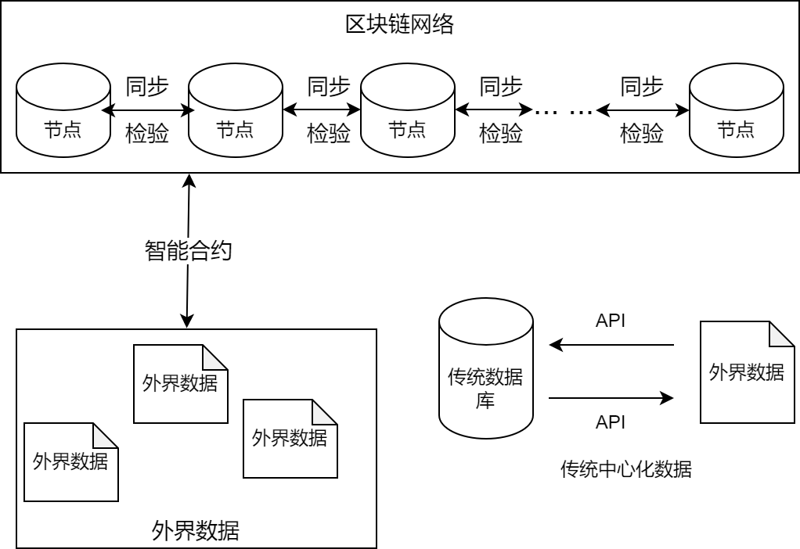

## 项目简介

这是基于区块链网络的成绩上链系统

## 为什么需要用到区块链技术来存储成绩？
传统中心化数据库存储成绩**存在篡改的可能性**，作为数据库的管理员可以对成绩等敏感信息进行操作，并且删除日志。

另外在传统数据库中，一台数据库如果因为不可抗力被毁坏，也会造成**数据丢失**，虽然可以使用分布式存储，但是数据库之间的同步会成为大问题，另外读取访问效率也会受到限制

区块链存储的核心特点就是：

***去中心化，数据不可篡改，永久保存***

### 去中心化

1. 可以将区块链网络想象成一个分布式的数据库，每个数据库独立，它们之间会自动判别和同步信息
2. 区块链的每一个节点都是一样的，类似于多个终端，从任何地方都可以无差别接入同一个系统
### 数据不可篡改
1. 区块链的数据通过智能合约与其交互，智能合约规定了所有数据的操作方法以及其权限
2. 通过智能合约操作的数据会被记录到每一个区块上，即正常合法记录
3. 非正常手段通过拦截以太坊节点，需要掌握51%的网络节点算力，这是几乎不可能的
4. 所有的记录都会被完整保存下来，并且通过算法同步到每一个节点上，无法更改或者抹除
### 永久保存
1. 只要操作是合法的，会将节点的操作记录保存下来，记录到区块上，每个区块都是关联下一个区块
2. 每一个节点会和其他节点同步，若有节点被摧毁或删除，当它再被重新接入的时候，会同步其它节点的信息
3. 只要存在一个节点，那么数据就会被保留下来，即为永久存储（因为不可能所有节点都消失）

